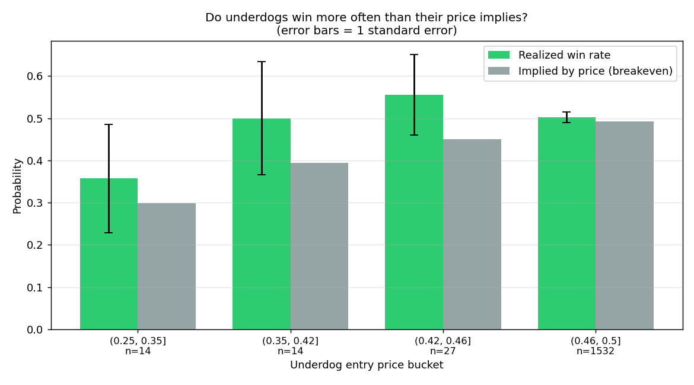
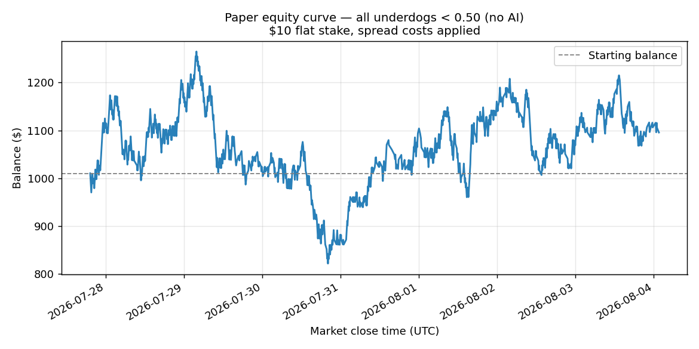

# Polymarket BTC 5m Reverse Trading Bot — AI Decision Model

A research bot that tests a specific idea on Polymarket's **BTC Up/Down 5-minute** markets: buy the **underdog** token priced below $0.50, betting the price *reverses* before the market closes. Because a winning share always settles at $1.00, a cheap entry produces an outsized payout — so the strategy can be profitable even when it loses more often than it wins.

This repository contains the full pipeline: real market data collection, an AI decision model, a leakage-free backtest, live paper trading, and a results dashboard.

**Headline result up front:** on 2,097 real resolved markets, the strategy showed **no statistically significant edge**, and the AI model's out-of-sample **ROC AUC was 0.505** — indistinguishable from a coin flip. The methodology and the numbers behind that conclusion are below.

---

## The Idea and Why It's Appealing

Every Polymarket outcome token trades between $0.00 and $1.00 and settles at exactly $1.00 if it wins. Buy at price **P**, and a win pays **1/P** per dollar staked.

| Entry price | Payout | Win rate needed to break even |
|-------------|--------|-------------------------------|
| $0.50 | 2.0× | 50% |
| $0.40 | 2.5× | 40% |
| $0.30 | 3.3× | 30% |
| $0.20 | 5.0× | 20% |

The appeal is real: at $0.30 you can be wrong **70%** of the time and still break even. You don't need to be right often, just more often than the price implies.

### The catch that makes this hard

In a market that prices things correctly, **the price *is* the probability**. A token at $0.30 wins about 30% of the time, which puts you at exactly break-even — and then the spread pushes you negative. Buying cheap tokens is not itself an edge.

An edge requires one of two things to be true:

1. The market **systematically underprices** underdogs, or
2. You can **predict reversals** better than the market can.

This project tests both claims against real data instead of assuming them. That distinction is the whole point: the arithmetic of the payout table above is often mistaken for an edge, and it isn't one.

---

## How It Works

```
┌──────────────────┐   ┌──────────────────┐   ┌────────────────────┐
│ Gamma API        │   │ CLOB API         │   │ Feature builder    │
│ resolved markets │──▶│ price path in    │──▶│ 12 signals at the  │
│ + true outcome   │   │ the 5m window    │   │ decision moment    │
└──────────────────┘   └──────────────────┘   └─────────┬──────────┘
                                                        │
                        ┌───────────────────────────────▼──────────┐
                        │ AI decision model (Gradient Boosting)    │
                        │ forward-chained: train past, test future │
                        └───────────────────┬──────────────────────┘
                                            │
              ┌─────────────────────────────▼─────────────────────────┐
              │ Backtest with real outcomes + spread costs            │
              │ → win rate vs breakeven, bootstrap confidence interval│
              └───────────────────────────────────────────────────────┘
```

A decision is frozen **60 seconds before each market closes**, using only price points observed at or before that instant. The label is how the market actually settled. Nothing about the future can leak into a feature — this is enforced by tests.

### Features

All twelve are computed from the real price path inside the 5-minute window:

| Feature | Meaning |
|---------|---------|
| `underdog_price` / `favorite_price` | Quoted prices of both sides |
| `price_move_in_window` | Underdog move since the window opened |
| `momentum_last_min` | Change over the final observed minute |
| `underdog_trend` | Slope of a linear fit through the path |
| `path_volatility` | Standard deviation of observed prices |
| `max_underdog_drawdown` | Largest drop from a running peak |
| `distance_from_50` | How deep the underdog is |
| `implied_payout` | 1 / price |
| `seconds_to_expiry` | Time left when deciding |
| `volume` | Market traded volume |
| `n_observations` | Price points available |

---

## Results on Real Data

**Dataset:** 2,097 resolved `btc-updown-5m` markets spanning 174 hours (~7.3 days), of which 1,587 had a genuine underdog below $0.50 and enough volume to quote meaningfully. Median market volume was about $44,000, so these are actively traded markets.

### 1. Does the market misprice underdogs?



| Entry price bucket | n | Avg entry | Realized win rate | Edge | Std error |
|--------------------|-----|-----------|-------------------|------|-----------|
| $0.25–0.35 | 14 | 0.298 | 35.7% | +5.9 pp | ±12.8 pp |
| $0.35–0.42 | 14 | 0.394 | 50.0% | +10.6 pp | ±13.4 pp |
| $0.42–0.46 | 27 | 0.450 | 55.6% | +10.5 pp | ±9.6 pp |
| $0.46–0.50 | **1,532** | 0.493 | 50.3% | +1.0 pp | ±1.3 pp |

The cheap buckets look promising — until you read the standard errors. With only 14–27 samples, an error bar of ±10 to ±13 points is as large as the edge itself, so those bars are noise, not signal. The one bucket with a trustworthy sample size (n=1,532) shows an edge of **+1.0 ± 1.3 points**, which is statistically zero.

There's also a structural problem visible in the data: **96% of all underdogs are quoted at $0.495**, essentially a coin flip. Deep underdogs in the $0.15–0.48 range that the strategy targets are rare, appearing in only 132 of 1,587 markets.

### 2. Can the AI model predict reversals?

Forward-chaining validation (train on the past, test on the future, never the reverse):

| Metric | Value | Interpretation |
|--------|-------|----------------|
| ROC AUC | **0.5054** | 0.50 is chance — no predictive power |
| Brier score | 0.2613 | ≈0.25 is the no-skill baseline |
| Out-of-sample rows | 1,320 | |

The model finds nothing. This is an honest negative result: order-flow features available at 1-minute resolution do not predict which side of a BTC 5-minute market wins.

### 3. Backtest with real outcomes and spread costs

Entering means crossing the spread, which on these markets is about one tick ($0.01). That cost is applied to every trade.

| Strategy | Trades | Win rate | Breakeven | Edge | ROI | EV per $1 | 95% CI | Significant |
|----------|--------|----------|-----------|------|-----|-----------|--------|-------------|
| Band $0.15–0.48, no AI | 132 | 47.73% | 45.06% | +2.67 pp | +9.1% | +0.069 | [−0.124, +0.264] | no |
| All underdogs < $0.50 | 1,587 | 50.22% | 49.97% | +0.25 pp | +9.6% | +0.006 | [−0.044, +0.054] | no |
| All underdogs, **zero** slippage | 1,587 | 50.22% | 48.97% | +1.25 pp | +42.3% | +0.027 | [−0.024, +0.076] | no |
| AI filter p ≥ 0.50 | 712 | 50.28% | 50.21% | +0.07 pp | +3.4% | +0.005 | [−0.068, +0.079] | no |
| AI filter p ≥ 0.55 | 385 | 49.09% | 50.10% | −1.01 pp | −6.2% | −0.016 | [−0.117, +0.084] | no |
| AI filter p ≥ 0.60 | 254 | 50.79% | 50.04% | +0.75 pp | +4.3% | +0.017 | [−0.108, +0.140] | no |



Every confidence interval contains zero. The equity curve above is the honest picture: a random walk that swings from $825 to $1,265 and drifts to roughly $1,100 across 1,587 trades. A curve like that is what a **zero-edge** strategy looks like, which is exactly why the confidence interval matters more than the ending balance.

Two further observations worth noting:

- **The AI filter does not help.** That follows directly from an AUC of 0.505; the p ≥ 0.55 threshold actually loses money.
- **Costs dominate.** Removing slippage lifts ROI from +9.6% to +42.3% without making it significant. Any real edge here is smaller than the spread you pay to enter.

---

## Verdict

On roughly a week of real data, this reverse-trading strategy shows **no statistically significant edge**, and the AI model has **no out-of-sample predictive power**. Reported honestly, this is a negative result.

What would change the conclusion:

- **More data on deep underdogs.** The $0.35–0.46 buckets showed a positive point estimate on 41 combined samples. Distinguishing that from noise needs hundreds of samples, which means months of history rather than a week.
- **Higher-resolution data.** The public price-history endpoint returns roughly one point per minute, giving only about four observations per window. Most price action happens in the final seconds, so a live order-book recorder would see far more.
- **Order book depth.** Resting bid/ask imbalance is plausibly the most informative reversal signal, and it isn't available historically. Recording it live is the most promising next step.

**Nothing here justifies trading real money.**

---

## Quick Start

```bash
git clone https://github.com/YOUR_USERNAME/polymarket-btc-5m-reverse-trading-bot-using-AI-making-decision-model.git
cd polymarket-btc-5m-reverse-trading-bot-using-AI-making-decision-model

python -m venv venv
source venv/bin/activate        # Windows: venv\Scripts\activate
pip install -r requirements.txt
cp .env.example .env
```

No API keys are needed. Every endpoint used is public and read-only.

### Reproduce the results

```bash
python scripts/fetch_history.py      # download real resolved markets (~4 min)
python scripts/run_backtest.py       # calibration, model validation, backtest
python scripts/make_charts.py        # regenerate the charts above
```

### Train the model

```bash
python scripts/train_model.py
```

### Live paper trading

Trades real open markets with no real money. Outcomes come from actual resolutions.

```bash
python scripts/run_paper_trading.py --dry-run     # inspect current markets, exit
python scripts/run_paper_trading.py --markets 5   # trade 5 markets (~25 min)
python scripts/run_paper_trading.py --no-ai       # skip the AI filter
```

A `--dry-run` against a live market looks like this — note the bot correctly declining a coin-flip price:

```
  btc-updown-5m-1785810600 closes in 86s (volume $0)
    underdog Up @ 0.495 (favorite 0.505)
    decision: skip — price 0.495 outside band [0.15, 0.48]
```

### Dashboard

```bash
streamlit run src/dashboard/app.py
```

### Tests

```bash
python -m pytest tests/ -q          # 27 tests
```

The suite covers the payout arithmetic, cost handling, and the no-leakage guarantees — including a test asserting that a 0.99-confidence prediction on markets that all lost still loses money, which is what makes the backtest trustworthy.

---

## Project Structure

```
├── src/
│   ├── data/
│   │   ├── fetch.py            # Gamma + CLOB downloader with disk cache
│   │   └── dataset.py          # leakage-free features, calibration table
│   ├── ai/
│   │   ├── decision_model.py   # gradient boosting, forward-chained validation
│   │   └── features.py         # feature column contract
│   ├── backtest/
│   │   └── engine.py           # real-outcome backtest, bootstrap CIs
│   ├── strategy/
│   │   └── reverse_trading.py  # entry band + AI confidence filter
│   ├── paper/
│   │   ├── engine.py           # live paper trading, settles on resolution
│   │   └── portfolio.py        # balance and trade tracking
│   ├── polymarket/
│   │   └── client.py           # read-only live market client
│   └── dashboard/app.py        # Streamlit results dashboard
├── scripts/
│   ├── fetch_history.py
│   ├── run_backtest.py
│   ├── train_model.py
│   ├── run_paper_trading.py
│   └── make_charts.py
├── tests/                      # 27 tests
└── docs/                       # generated charts
```

---

## Configuration

Set in `.env` (see `.env.example`):

| Variable | Default | Description |
|----------|---------|-------------|
| `INITIAL_BALANCE` | 1000.0 | Starting paper balance (USDC) |
| `STAKE` | 10.0 | Flat stake per trade |
| `MIN_TOKEN_PRICE` | 0.15 | Lower bound of the entry band |
| `MAX_TOKEN_PRICE` | 0.48 | Upper bound of the entry band |
| `MIN_AI_CONFIDENCE` | 0.55 | Minimum model probability to enter |
| `SLIPPAGE` | 0.01 | Spread cost on entry, in probability units |
| `DECISION_OFFSET_SECONDS` | 60 | When to decide, before close |
| `MIN_MARKET_VOLUME` | 1000.0 | Ignore markets with stale quotes |

---

## Methodology Notes

Choices made to keep the results trustworthy:

- **Outcomes are never derived from model output.** Every trade settles from real market resolution. A test enforces this.
- **Forward-chaining validation only.** A prediction is never made with a model that saw that period. Early rows have no prediction and are excluded from AI-filtered runs.
- **Costs are applied.** One tick of slippage on entry, matching the observed ~$0.495/$0.505 book.
- **Significance over point estimates.** Bootstrap confidence intervals (10,000 resamples) accompany every result, because a positive ROI on a few hundred coin flips is not evidence.
- **Illiquid markets excluded.** Markets below $1,000 volume have placeholder quotes that never move.

Known limitations: about one price observation per minute; no historical order-book depth; roughly one week of history; and results specific to BTC 5-minute markets in this period.

---

## Live Trading Pipeline

This project is built for **live market operation** via paper trading on real Polymarket BTC 5-minute Up/Down markets:

- Connects to live Polymarket market data (Gamma + CLOB)
- Makes timed decisions before each market close
- Applies the AI confidence filter and entry price band in real time
- Settles trades from actual market resolutions
- Tracks portfolio balance, stake sizing, and trade history
- Ships with a Streamlit dashboard for monitoring results

Use paper trading to validate the full live loop before considering any real-money integration:

```bash
python scripts/run_paper_trading.py --dry-run
python scripts/run_paper_trading.py --markets 5
```

The current bot path is paper trading only (no order placement). Treat live real-money use as a separate integration step and validate against the backtest results first.

## License

MIT
